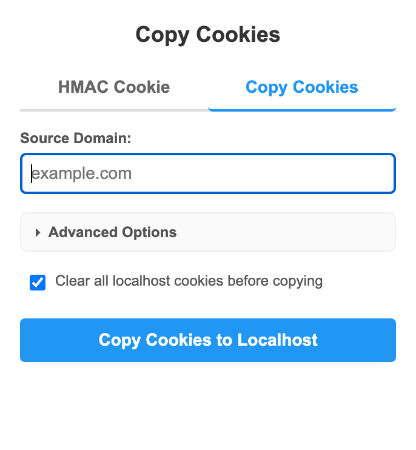
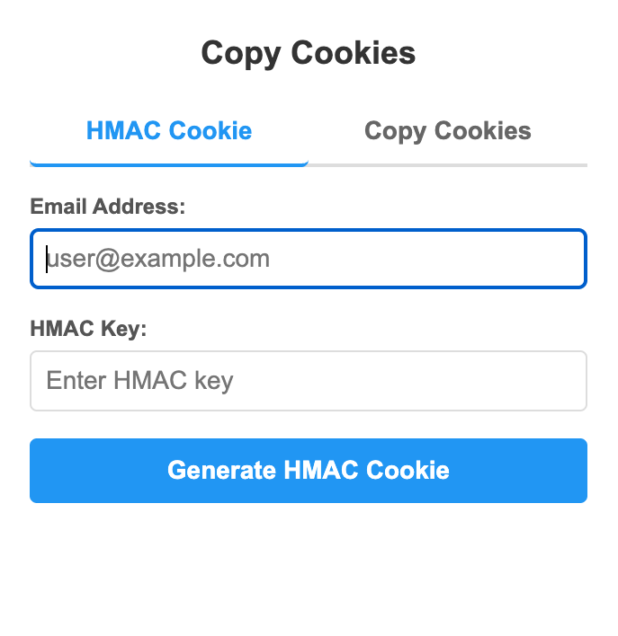

# Copy Cookies - Chrome Extension

**Effortlessly copy cookies from any website to localhost for seamless development and testing.**

| | |
|:---:|:---:|
|  |  |

## 🚀 What it does

Copy Cookies is a developer-friendly Chrome extension that simplifies the process of copying cookies from any domain to localhost. Perfect for developers who need to test applications with real user session data or authentication cookies.

## ✨ Key Features

- **🎯 Smart Domain Detection** - Automatically detects and populates the current website's domain
- **🔄 One-Click Cookie Transfer** - Copy all cookies from any domain to localhost instantly
- **✅ Real-time Status Updates** - Get immediate feedback on the copying process
- **🛡️ Input Validation** - Built-in domain name validation for error-free operation
- **🔧 Cookie Attribute Handling** - Properly handles httpOnly, sameSite, and other cookie attributes
- **🎨 Clean, Intuitive Interface** - Simple and user-friendly design

## 🎯 Perfect for Developers

- **Local Development** - Test your applications with real session cookies
- **Authentication Testing** - Copy login cookies to test authenticated features locally
- **Cross-Domain Development** - Work with cookies from staging or production environments
- **API Testing** - Use real authentication cookies for API development

## 📱 How to Use

1. **Navigate** to any website in Chrome
2. **Click** the Copy Cookies extension icon in your toolbar
3. **Verify** the auto-populated domain (or edit if needed)
4. **Click** "Copy Cookies to Localhost"
5. **Done!** All cookies are now available on localhost

## 🔒 Privacy & Security

- **Local Processing** - All cookie operations happen locally in your browser
- **No Data Collection** - We don't collect, store, or transmit any of your data
- **Secure Handling** - Cookies are processed securely within Chrome's extension environment
- **Permission Transparency** - Only requests necessary permissions for cookie operations

## 🛠️ Development Setup

### Installation for Development

1. **Download or clone** this repository
2. **Open Chrome** and navigate to `chrome://extensions/`
3. **Enable "Developer mode"** in the top right corner
4. **Click "Load unpacked"** and select the project folder
5. **The extension** will appear in your extensions list

### Development Notes

- The extension requires "cookies" permission to read and write cookies
- Cookies are copied to `http://localhost` (not HTTPS)
- Secure cookies from HTTPS sites are converted to non-secure for localhost compatibility
- The extension handles various cookie attributes including httpOnly and sameSite

### Project Structure

```
copy-cookies/
├── manifest.json          # Extension configuration and permissions
├── popup.html            # User interface
├── css/
│   └── popup.css         # Styling for the popup
├── js/
│   └── popup.js          # Main functionality for copying cookies
└── img/
    ├── icon16.png        # Extension icon (16x16)
    ├── icon48.png        # Extension icon (48x48)
    ├── icon128.png       # Extension icon (128x128)
    ├── ui1.png           # UI screenshot 1
    └── ui2.png           # UI screenshot 2
```

### Required Permissions

- **`cookies`** - Read cookies from source domains and write to localhost
- **`activeTab`** - Work with the current tab
- **`tabs`** - Query the current tab's URL for auto-populating the domain
- **`host_permissions`** - Access cookies from any HTTP/HTTPS domain

## 🐛 Troubleshooting

**Domain Issues:**

- Ensure the domain is entered correctly (without http:// or https://)
- Check for typos in the domain name

**Cookie Copying Issues:**

- Some cookies might not be copyable due to browser security restrictions
- Check the browser console (F12) for detailed error messages
- Ensure you have the necessary permissions for the target domain

**Extension Not Working:**

- Verify the extension is enabled in `chrome://extensions/`
- Try refreshing the page and reopening the extension
- Check if the extension has the required permissions

## 📄 License

This project is open source and available under the MIT License.

## 🤝 Contributing

Contributions are welcome! Please feel free to submit a Pull Request.

---

**Made with ❤️ for developers who need to work with cookies locally.**
