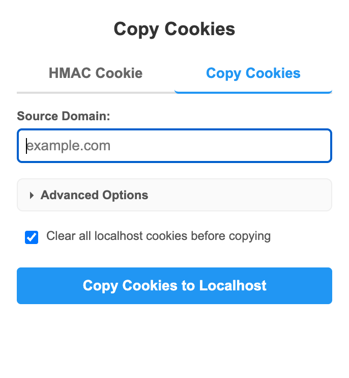
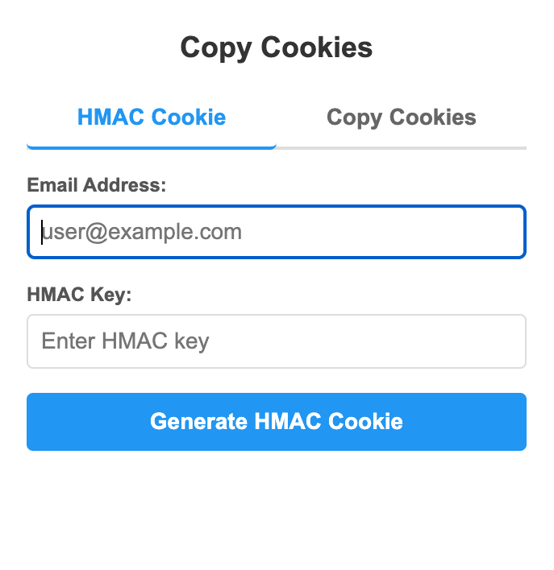

# Copy Cookies - Chrome and Firefox Extension

**Effortlessly copy cookies from any website to localhost and generate HMAC cookies for seamless development and testing.**

| | |
|:---:|:---:|
|  |  |

## 🚀 What it does

Copy Cookies is a developer-friendly browser extension for Chrome and Firefox that simplifies copying cookies from any domain to localhost and generating HMAC cookies on demand. It is built for developers who need to test applications with real session data or authentication cookies.

## ✨ Key Features

- **🎯 Smart Domain Detection** - Automatically detects and populates the current website's domain
- **🔄 One-Click Cookie Transfer** - Copy all cookies from any domain to localhost instantly
- **🔐 HMAC Cookie Generator** - Create an `_auth_passcode_hmac` cookie for the active domain
- **✅ Real-time Status Updates** - Get immediate feedback on the copying process
- **🛡️ Input Validation** - Built-in domain name and email validation for error-free operation
- **🔧 Cookie Attribute Handling** - Properly handles httpOnly, sameSite, and other cookie attributes
- **🎨 Clean, Intuitive Interface** - Simple and user-friendly design

## 🎯 Perfect for Developers

- **Local Development** - Test your applications with real session cookies
- **Authentication Testing** - Copy login cookies to test authenticated features locally
- **Cross-Domain Development** - Work with cookies from staging or production environments
- **API Testing** - Use real authentication cookies for API development

## 📱 How to Use

1. **Navigate** to any website in Chrome or Firefox
2. **Click** the Copy Cookies extension icon in your toolbar
3. **Choose** the Copy Cookies tab
4. **Verify** the auto-populated domain (or edit if needed)
5. **Optionally** expand Advanced Options to set cookie expiration
6. **Click** "Copy Cookies to Localhost"
7. **Done!** All cookies are now available on localhost

### Generate an HMAC Cookie

1. **Choose** the HMAC Cookie tab
2. **Enter** your email address and HMAC key
3. **Click** "Generate HMAC Cookie" to set `_auth_passcode_hmac` on the current domain

### Advanced Options

- **Cookie Expiration** - Keep the original expiration or choose a development/testing/session/custom duration
- **Clear Localhost First** - Wipe existing localhost cookies before copying when enabled

## 🔒 Privacy & Security

- **Local Processing** - All cookie operations happen locally in your browser
- **No Data Collection** - We don't collect, store, or transmit any of your data
- **Secure Handling** - Cookies are processed within the browser extension environment
- **Permission Transparency** - Only requests necessary permissions for cookie operations

## 🛠️ Development Setup

### Installation for Development

Install dependencies and build both browser targets:

```bash
npm install
npm run build
```

For Chrome, open `chrome://extensions/`, enable Developer mode, click **Load unpacked**, and select `dist/chrome`.

> Do not load the repository root or `apps/chrome`. They contain source configuration, not a complete extension. Always load the generated `dist/chrome` directory.

For Firefox, open `about:debugging#/runtime/this-firefox`, click **Load Temporary Add-on**, and select `dist/firefox/manifest.json`. You can also build and launch Firefox with:

```bash
npm run dev:firefox
```

See [INSTALLATION.md](INSTALLATION.md) for complete instructions.

### Build Commands

```bash
npm run build             # Build Chrome and Firefox directories
npm run build:chrome      # Build only dist/chrome
npm run build:firefox     # Build only dist/firefox
npm run lint              # Validate both manifests and the Firefox build
npm run package           # Create browser-specific ZIP artifacts
```

### Development Notes

- The extension requires "cookies" permission to read and write cookies
- Cookies are copied to `http://localhost` (not HTTPS)
- Secure cookies from HTTPS sites are converted to non-secure for localhost compatibility
- Success messages include a quick link to open localhost
- The extension handles various cookie attributes including httpOnly and sameSite

### Project Structure

```
copy-cookies/
├── apps/
│   ├── chrome/            # Chrome manifest and workspace metadata
│   └── firefox/           # Firefox manifest and workspace metadata
├── packages/
│   └── extension-core/    # Shared popup, scripts, styles, and icons
├── scripts/
│   └── build.mjs          # Assembles browser-specific builds
├── dist/                  # Generated unpacked extensions (gitignored)
├── artifacts/             # Generated ZIP packages (gitignored)
└── img/                   # README screenshots
```

The checked-in source stays shared under `packages/extension-core`. Each app owns only its browser-specific manifest. Generated files are kept out of Git so Chrome and Firefox source code cannot drift apart.

### Required Permissions

- **`cookies`** - Read cookies from source domains and write to localhost
- **`activeTab`** - Work with the current tab
- **`tabs`** - Query the current tab's URL for auto-populating the domain
- **`storage`** - Store recent HMAC settings
- **`host_permissions`** - Access cookies from any HTTP/HTTPS domain

## 🐛 Troubleshooting

**Domain Issues:**

- Ensure the domain is entered correctly (without http:// or https://)
- Check for typos in the domain name

**Cookie Copying Issues:**

- Some cookies might not be copyable due to browser security restrictions
- Check the browser console (F12) for detailed error messages
- Ensure you have the necessary permissions for the target domain

**Extension Not Working:**

- Rebuild with `npm run build` after changing source files
- Verify the extension is enabled in `chrome://extensions/` or `about:addons`
- Try refreshing the page and reopening the extension
- Check if the extension has the required permissions

## 📄 License

This project is open source and available under the MIT License.

## 🤝 Contributing

Contributions are welcome! Please feel free to submit a Pull Request.

---

**Made with ❤️ for developers who need to work with cookies locally.**
